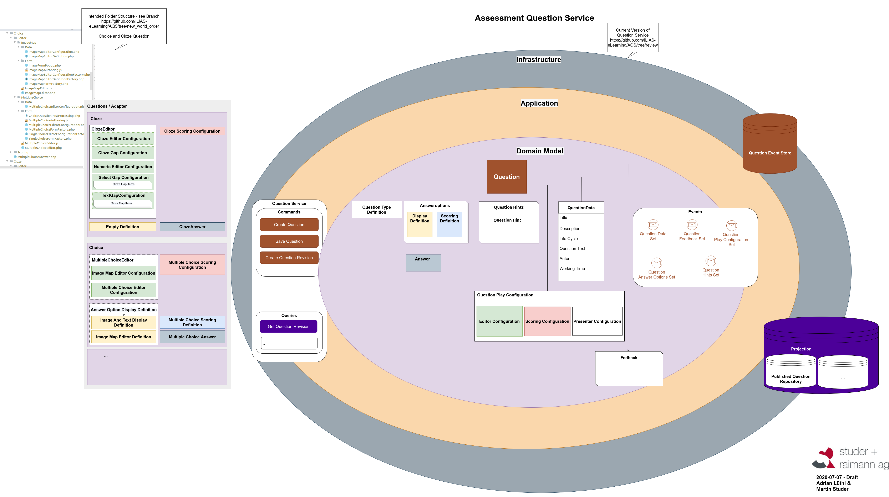
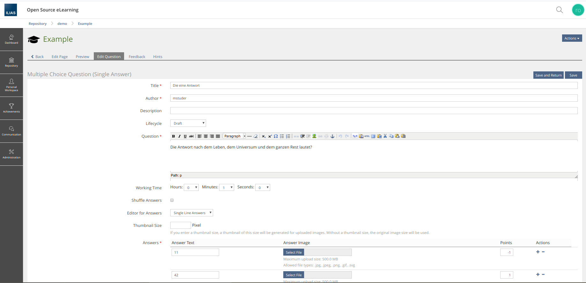

# ILIAS - ASQ - Assessment Question Service

The ILIAS ASQ is designed as a component that offers services around assessment questions. The way other components can interact with ASQ is as easy and flexible as possible. The ASQ provides a complete authoring and scoring environment for assessment questions.

The ASQ provides no higher level business logic. Those must be handled by the consumer. E.g. the business logic that a single question can only be answered once or the business logic for handling a group of questions so that questions can only have a single answer. 
  
 
 

# Status
BETA - Feature Complete

 
 

# History
[History](docs/0_History/README.md)

 
 

# Features

## Available question types

At the Moment ASQ implements the following Question Types. The available types are identical with the question types offered by the default ILIAS Test. The two old Cloze style Questions have been rolled in one Type. 

It is easyly able to extend and change the existing question types for different usages. See as example the implementation of the old Singlechoice and Multiplechoice questions which are not internally handled as the same Question Type, but offer different configuration GUIs for backward compatibility. (Same with Ordering and TextOrdering Question)

* Cloze	(ConfigForm move to Kitchen Sink UI is broken ATM)
* Error
* Essay
* FileUpload
* Formula
* Kprim
* Matching
* MultipleChoice
* Numeric
* Ordering
* TextSubset

For every Question type exists an Authoring form, Integration into QuestionControl for display purposes and an automatic Scoring Module.
  
# Architecture

The fundamental architecture is a CQRS type inplementation using Event Sourcing for Data Storage.

## Event Sourcing

Event Sourcing is used to preserve History of Data as is requested by some Stakeholders. ([See Feature Wiki](https://docu.ilias.de/goto_docu_wiki_wpage_5312_1357.html)) In discussions about that Feature with the Stakeholders it was clear that some actually want a history and not a Versioning Scheme. But Eventsourced is also the best way to allow for different Versions, as every state of an object that has ever existed can without problems be restored.

Also as test results sometimes are challenged legally the ability to prove what state was at which moment is very important to users. It would even to be possibly to implement forward hashing on an eventsourced storage to be able to guarantee the integrity of the data with absolute certanity.

## CQRS

CQRS and the work with projections follows automatically from Eventsourcing, as performance can be increased enormously by using that approach. Also a Domain driven approach makes the code easyer to understand as the usage and not theoretical abstractions are paramount.
  
## The ASQ Interface

Interaction with ASQ is through the four service it offers to the user.

### Question Service

The Service used to interact with questions allows creation, reading and updating operations

# Requirements
* PHP 7.3
* ILIAS 7 -
* https://github.com/studer-raimann/cqrs
  
 
 

# How to use?
* [1 Setting Up](docs/1_Setting_Up/README.md)
* [2 Create Questions](docs/2_Create_Questions/README.md)
* [3 Edit Questions](docs/3_Edit_Questions/README.md)
* [4 Get Questions](docs/4_Get_Questions/README.md)
* [5 Score Answer](docs/5_Score_Answer/README.md)
 
 
 

# Authors
This is an OpenSource project by studer + raimann ag (https://studer-raimann.ch)
 
 
 

# License
This project is licensed under the GPL v3 License
 
 
 

# Credits

## Coordination of Funding
*  toedt@leifos.com

## Funding
* DHBW Karlsruhe
* FH Aachen
* HS Bremen
* ILIAS e.V. Advisory Council
* ILIAS e.V. Technical Board
* PH Freiburg (DE)
* studer + raimann ag, Burgdorf
* Universität Bern
* Universität Freiburg (DE)
* Universität Hohenheim
* Universität Marburg
* Universität zu Köln

## Development and software architecture
* al@studer-raimann.ch
* bh@bjoernheyser.de
* ms@studer-raimann.ch
* tt@studer-raimann.ch

## Quality control
* dw@studer-raimann.ch

## Supervision
* ILIAS SIG E-Assessment, https://docu.ilias.de/goto_docu_grp_5174.html - first of all denis.strassner@uni-hohenheim.de
* ILIAS Technical Board, https://docu.ilias.de/goto_docu_grp_5089.html - first of all stephan.winiker@hslu.ch
