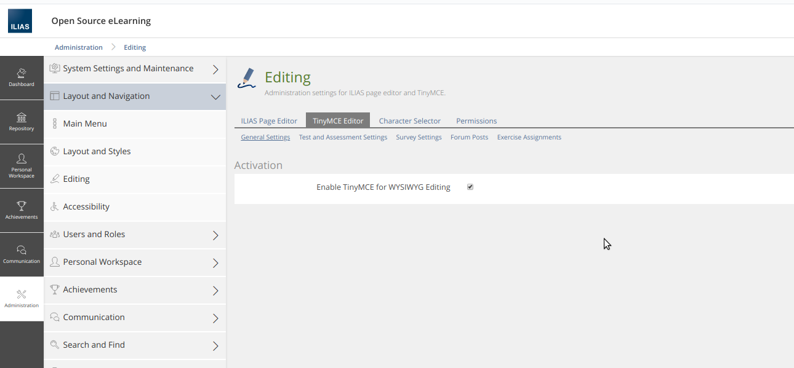

# Setting up

If you want to use the Assessment Question Service within a Repository Objects Plugin, proceed as follows.
While it is in this form ASQ creates its own dependency injection container $ASQDIC, with acceptance into core, that code would move into the standard ILIAS dependency injection container.
<br>
<br>


## Table of contents
- [Get the ASQ Library and the CQRS dependency by composer](#get-the-asq-library-and-the-cqrs-dependency-by-composer)
- [Install Data Tables and Update Languages](#install-data-tables-and-update-languages) 
- [Enable TinyMCE](#enable-tinymce)
    
<br>
<br>


## Get the ASQ library and the CQRS dependency by composer
Load the two libraries "asq" und "cqrs" from github and make sure the classmap includes the directory "vendor/srag/asq/classes".

For this just integrate the following lines into the composer.json of your plugin and update the dependencies.

```json
"repositories": [
    {
      "type": "vcs",
      "url": "https://github.com/studer-raimann/asq.git"
    },
    {
      "type": "vcs",
      "url": "https://github.com/studer-raimann/cqrs.git"
    }
  ],
  "require": {
   [...]
    "srag/asq": "review",
    "srag/cqrs": "dev-cqrs-asq"
  },
  "autoload": {
    [...]
    "classmap": [
      "classes/",
      "vendor/srag/asq/classes"
    ]
  },
```

Example: [composer.json_example](composer.json_example)
    
<br>
<br>


## Install data tables and update languages

Run the following statement:

```php
use srag\asq\Infrastructure\Setup\lang\SetupAsqLanguages;
use srag\asq\Infrastructure\Setup\sql\SetupDatabase;

public function installASQ() : void {
    SetupDatabase::new()->run();
    SetupAsqLanguages::new()->run();
}
```


## Enable TinyMCE
You **MUST** enable TinyMCE.
   
 


